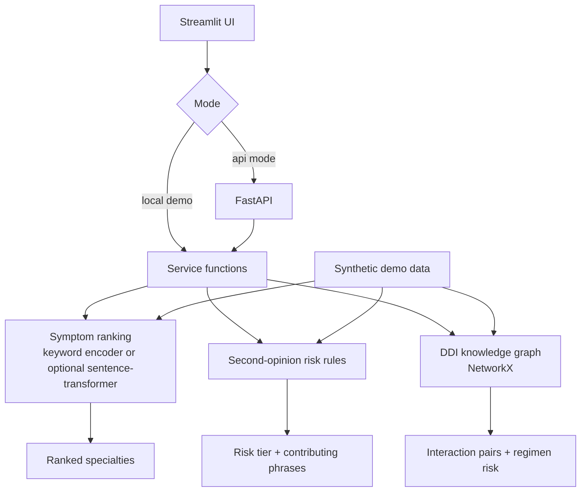

# AI Healthcare Intelligence Engine

FastAPI and Streamlit clinical decision-support demo for three synthetic healthcare workflows: symptom-to-specialist ranking, second-opinion risk stratification, and drug-drug interaction lookup.

This is a portfolio project, not a medical device and not medical advice. It uses synthetic/demo data and deterministic fallbacks by default so it can run in CI and public cloud environments without private data, paid APIs, GPUs, or model downloads.

## Why This Project Matters

Healthcare AI projects are easy to overclaim. This project is useful on a resume because it shows the opposite habit: clear safety boundaries, deterministic fallback behavior, input validation, synthetic evaluation, latency benchmarks, API tests, and deployment-aware engineering.

It demonstrates how to wrap AI-adjacent clinical workflows in reliable software instead of depending on an opaque model for every decision.

## Current Status

- Live demo: not deployed yet
- CI: configured in `.github/workflows/ci.yml`
- Deployment target: Streamlit Cloud single-app demo in local deterministic mode
- Default embedding backend: deterministic keyword encoder
- Optional local ML backend: `sentence-transformers` via `requirements-ml.txt`

## Features

- Symptom-to-specialist ranking over a synthetic case corpus
- Optional sentence-transformer encoder for local semantic experiments
- Deterministic keyword encoder for CI and Streamlit Cloud
- Second-opinion risk stratifier with explainable contributing phrases
- Drug-drug interaction lookup backed by a NetworkX knowledge graph
- RxNorm-style local alias normalization for common medication names
- FastAPI API with request validation and `/health`
- Streamlit UI that can run standalone without a separate API process
- Synthetic evaluation and benchmark reports
- Pytest suite covering APIs, rules, graph lookup, vector search, and data normalizers

## Architecture



## Evaluation

Evaluation uses synthetic/demo data committed to this repository. These numbers are regression evidence, not clinical accuracy claims.

Latest measured local run:

- Symptom specialist top-1 accuracy: `100.00%` over `20` cases
- Symptom specialist top-3 accuracy: `100.00%` over `20` cases
- Second-opinion risk accuracy: `100.00%` over `20` cases
- DDI positive recall: `100.00%` over `20` known interactions
- DDI negative specificity: `100.00%` over `4` negative pairs

Run:

```bash
HEALTHCARE_EMBEDDING_BACKEND=keyword python evaluation/run_evaluation.py
```

Outputs:

- `evaluation/results.json`
- `evaluation/results.md`

## Benchmarks

Latest measured local run using the deterministic keyword backend:

- Python: `3.14.5`
- Platform: `macOS-26.5.2-arm64-arm-64bit-Mach-O`
- Iterations: `10`
- API app creation median: `0.10 ms`
- Symptom ranking median: `0.03 ms`
- Second-opinion risk median: `0.04 ms`
- Drug interaction check median: `0.07 ms`

Run:

```bash
HEALTHCARE_EMBEDDING_BACKEND=keyword python benchmarks/run_benchmarks.py 10
```

Outputs:

- `benchmarks/results.json`
- `benchmarks/results.md`

## Setup

```bash
python3.12 -m venv .venv
source .venv/bin/activate
pip install -r requirements-dev.txt
```

The root `requirements.txt` delegates to `ai-healthcare-intel-engine/requirements.txt` for Streamlit Cloud compatibility.

## Run the Streamlit Demo

Default standalone mode:

```bash
HEALTHCARE_EMBEDDING_BACKEND=keyword streamlit run ai-healthcare-intel-engine/frontend/app.py
```

This mode calls the service layer directly and does not require a FastAPI server.

## Run the FastAPI Backend

```bash
cd ai-healthcare-intel-engine
HEALTHCARE_EMBEDDING_BACKEND=keyword uvicorn api.main:app --reload --port 8000
```

API docs:

```text
http://localhost:8000/docs
```

Health check:

```text
http://localhost:8000/health
```

## Run the Streamlit UI Against the API

```bash
HEALTHCARE_FRONTEND_MODE=api API_URL=http://localhost:8000 streamlit run ai-healthcare-intel-engine/frontend/app.py
```

## Optional Sentence-Transformer Backend

The default backend avoids downloads. To experiment locally with sentence-transformers:

```bash
pip install -r requirements-ml.txt
HEALTHCARE_EMBEDDING_BACKEND=sentence-transformer streamlit run ai-healthcare-intel-engine/frontend/app.py
```

Do not enable this path in normal CI or low-resource public deployments.

## Configuration

| Variable | Default | Purpose |
| --- | --- | --- |
| `HEALTHCARE_EMBEDDING_BACKEND` | `keyword` | `keyword` or `sentence-transformer` |
| `SYMPTOM_ENCODER_MODEL_NAME` | `sentence-transformers/all-MiniLM-L6-v2` | Optional local embedding model |
| `HEALTHCARE_FRONTEND_MODE` | `local` | `local` service calls or `api` HTTP calls |
| `API_URL` | empty | Required only when `HEALTHCARE_FRONTEND_MODE=api` |
| `API_TIMEOUT_SECONDS` | `15` | Streamlit HTTP request timeout |
| `CORS_ALLOW_ORIGINS` | `*` | Comma-separated FastAPI CORS origins |

## Testing

```bash
ruff check .
python -m compileall ai-healthcare-intel-engine tests evaluation benchmarks
pytest
python evaluation/run_evaluation.py
python benchmarks/run_benchmarks.py 1
```

CI uses Python 3.12 and deterministic keyword mode.

## Deployment

Recommended free deployment: Streamlit Cloud.

Settings:

- Repository: `shreyshrivastava/ai-healthcare-intel-engine`
- Branch: `main` after merge
- Main file path: `ai-healthcare-intel-engine/frontend/app.py`
- Environment:
  - `HEALTHCARE_FRONTEND_MODE=local`
  - `HEALTHCARE_EMBEDDING_BACKEND=keyword`

This deploys a standalone deterministic demo. Deploy the FastAPI backend separately only if you specifically need API-mode demos.

## Privacy and Safety

- Do not enter real patient identifiers or protected health information.
- Demo data is synthetic.
- No external LLM/API calls are used by default.
- The optional sentence-transformer backend may download a public model when enabled locally.
- This project does not provide diagnosis, treatment, or medication advice.

See `docs/privacy.md` and `docs/limitations.md`.

## Project Structure

```text
ai-healthcare-intel-engine/
  api/                         FastAPI app, schemas, routers
  core/                        embedding and vector search utilities
  data/demo/                   synthetic demo data
  data/external/               ignored user-provided data templates
  frontend/                    Streamlit UI
  services/                    clinical workflow services
benchmarks/                    deterministic benchmark script and results
docs/                          architecture, deployment, privacy, audit docs
evaluation/                    synthetic evaluation script and results
tests/                         pytest suite
.github/workflows/             CI and benchmark workflows
```

## Resume Positioning

Best title:

```text
AI Healthcare Intelligence Engine
```

One-line description:

```text
Built a FastAPI and Streamlit clinical decision-support demo with deterministic symptom ranking, explainable risk stratification, DDI graph lookup, CI-safe evaluation, and deployment-ready fallback behavior.
```

## License

MIT License. See `LICENSE`.
