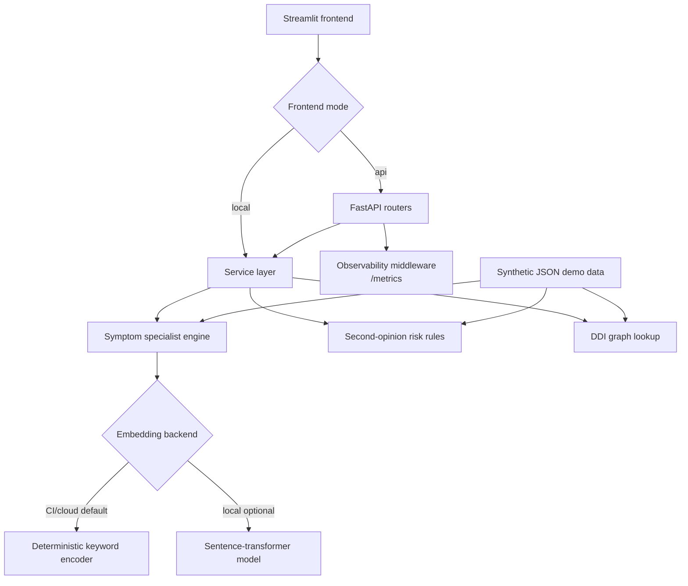

# Architecture

## Purpose

The project is a clinical decision-support demo with three bounded workflows:

- symptom-to-specialist ranking
- second-opinion risk stratification
- drug-drug interaction lookup

The app is intentionally deterministic by default. Optional sentence-transformer embeddings can be enabled locally, but CI and deployment use the keyword backend.

## System Diagram



## Design Decisions

- Use deterministic keyword embeddings by default so the project is runnable without model downloads.
- Keep sentence-transformers optional for local experimentation.
- Use NetworkX for the demo DDI graph because the data size is small and graph semantics are easy to inspect.
- Keep external dataset converters separate from serving logic.
- Treat evaluation numbers as regression evidence, not clinical validity claims.

## Main Components

```text
api/main.py                                   FastAPI app factory and health endpoint
api/schemas.py                                Pydantic validation models
services/symptom_specialist/model.py          symptom ranking service
services/second_opinion/model.py              risk stratification rules
services/drug_interaction/inference.py        DDI lookup and alias normalization
core/models.py                                keyword or optional sentence-transformer encoder
core/vector_store.py                          cosine similarity search
core/observability.py                         request timing and aggregate metrics
frontend/app.py                               Streamlit app
```
